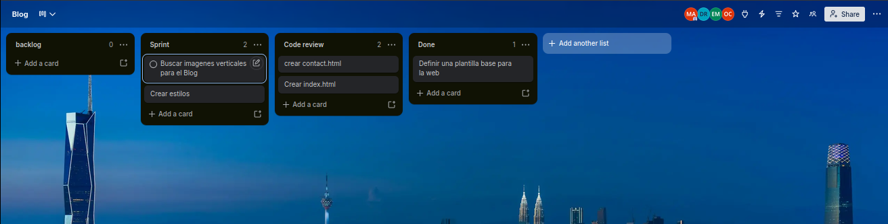

# Simulacion de Proyecto SCRUM

> TIFC2DEV-SDPF6

Simulación de desarrollo ágil aplicando la metodología SCRUM.

## 📋 Gestión del Proyecto

- [Tablero de Trello](https://trello.com/invite/b/6a5f9d3097d9d9cd8eb9cc69/ATTIad44fa0a8ae395140fa24709beea11fa7C17C378/blog)

